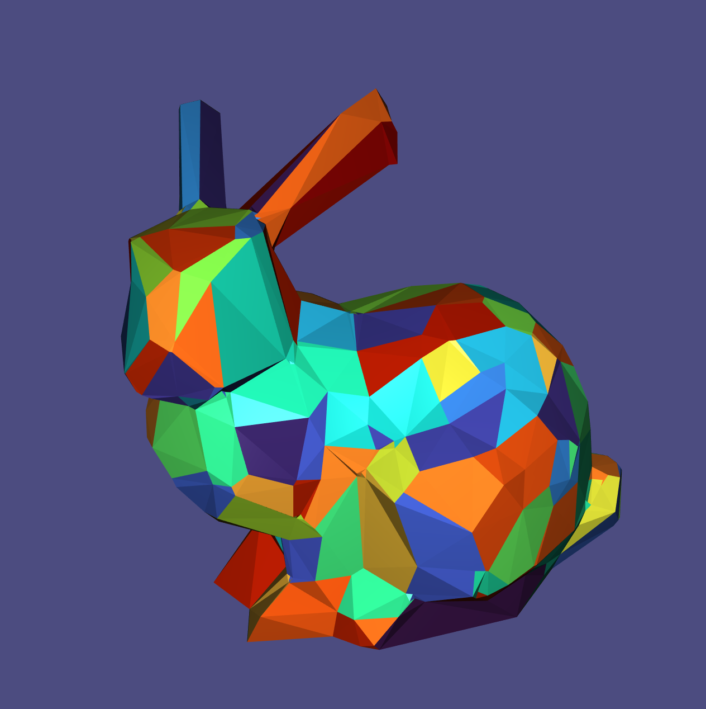

# VSA

An implementation of the variational shape approximation method 

### To run the code (from /build)
./variational_bin smooth_bunny 180 0.3

Then press 'S' -> wait -> press 5 --> press 'L'

### To interact with the mesh

S: Iterate until convergence

L: hide/show edges

1: Hide mesh 

2: Display mesh

3: One iteration (Region mapping + proxy fitting)

4: Draw anchors

5: Triangulate 

6: Alternative triangulation coloring

7: Draw proxies

8: 10 iterations

9: 100 iterations
